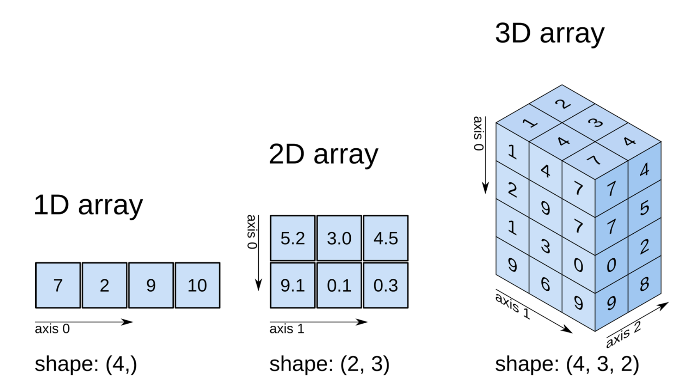

# Matriz (Array Bidimensional)

Uma matriz 2D, também conhecida como array bidimensional, é uma estrutura de dados que organiza informações em duas dimensões, formando uma grade retangular. Ela é uma coleção ordenada de elementos, onde cada elemento é identificado por um par de índices, um índice de linha e um índice de coluna.



## Características Principais:

- **Estrutura de Dados Bidimensional**: Matrizes 2D são estruturas bidimensionais, o que significa que os elementos são organizados em linhas e colunas, formando uma grade.

- **Acesso por Índices**: Cada elemento da matriz é acessado por meio de dois índices: um para especificar a linha e outro para especificar a coluna.

- **Elementos Homogêneos**: Todos os elementos de uma matriz 2D são do mesmo tipo de dados, o que a torna homogênea.

- **Tamanho Fixo**: As matrizes 2D têm um tamanho fixo, o que significa que o número de linhas e colunas é definido durante a declaração e não pode ser alterado posteriormente.

- **Representação Visual**: Matrizes 2D podem ser visualizadas como tabelas retangulares, onde cada célula contém um elemento.

## Declaração de Matriz 2D em Pascal:

Em Pascal, você pode declarar uma matriz 2D usando a seguinte sintaxe:

```pascal
var
  nomeMatriz: array[linhaInicial..linhaFinal, colunaInicial..colunaFinal] of TipoDado;
```

Aqui, `nomeMatriz` é o nome da matriz, `linhaInicial` e `linhaFinal` definem o intervalo de índices para linhas, e `colunaInicial` e `colunaFinal` definem o intervalo de índices para colunas. TipoDado é o tipo de dados que a matriz conterá.

## Operações Comuns em Matrizes 2D:

- **Preenchimento de Matriz**: Você pode preencher uma matriz 2D atribuindo valores a seus elementos por meio de loops ou inserção direta.

- **Acesso a Elementos**: Para acessar um elemento específico, utilize os índices da linha e da coluna, como matriz[linha, coluna].

- **Iteração**: Use loops aninhados para percorrer todos os elementos da matriz, normalmente usando loops for.

- **Manipulação de Dados**: Realize operações matemáticas, como adição ou multiplicação, com os elementos da matriz.

- **Aplicações**: Matrizes 2D são amplamente utilizadas em áreas como processamento de imagens, gráficos, simulações, jogos, cálculos matriciais e armazenamento de dados tabulares.

## Exemplo de Código em Pascal:

```pascal
program ExemploMatriz2D;
var
  matriz: array[1..3, 1..3] of Integer;
  i, j: Integer;
begin
  // Preencher a matriz
  for i := 1 to 3 do
    for j := 1 to 3 do
      matriz[i, j] := i * j;

  // Exibir a matriz
  for i := 1 to 3 do
  begin
    for j := 1 to 3 do
      write(matriz[i, j], ' ');
    writeln;
  end;
end.
```

Este programa em Pascal cria, preenche e exibe uma matriz 2D 3x3 como exemplo.


